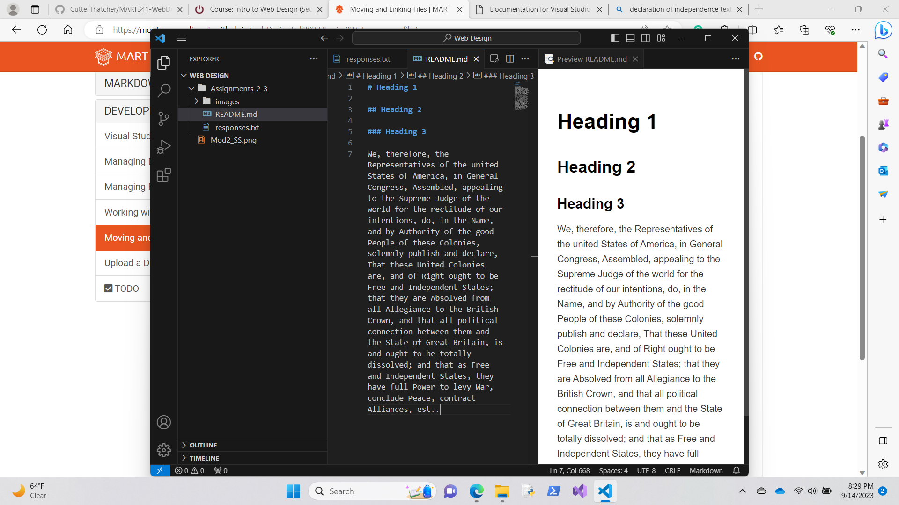

# Heading 1

## Heading 2

### Heading 3

We, therefore, the Representatives of the united States of America, in General Congress, Assembled, appealing to the Supreme Judge of the world for the rectitude of our intentions, do, in the Name, and by Authority of the good People of these Colonies, solemnly publish and declare, That these United Colonies are, and of Right ought to be Free and Independent States; that they are Absolved from all Allegiance to the British Crown, and that all political connection between them and the State of Great Britain, is and ought to be totally dissolved; and that as Free and Independent States, they have full Power to levy War, conclude Peace, contract Alliances, est..

[Click Here](https://www.youtube.com/results?search_query=space+song)

[responses](./responses.txt)

